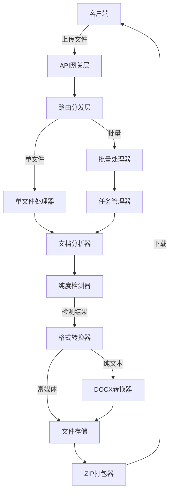
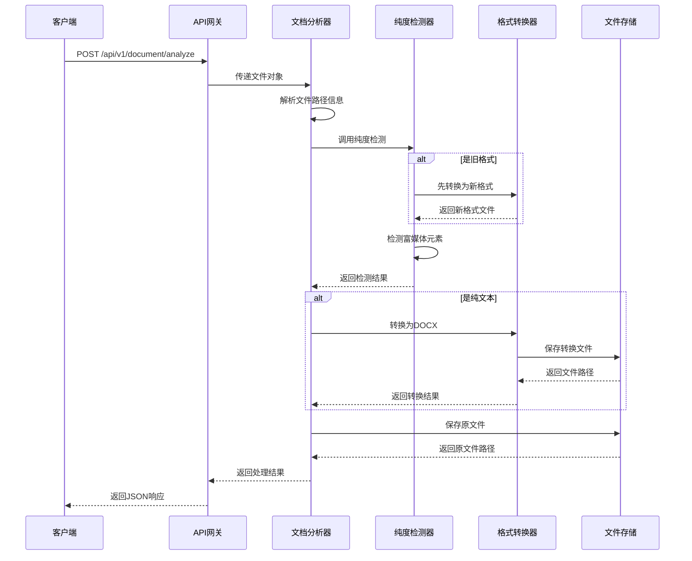
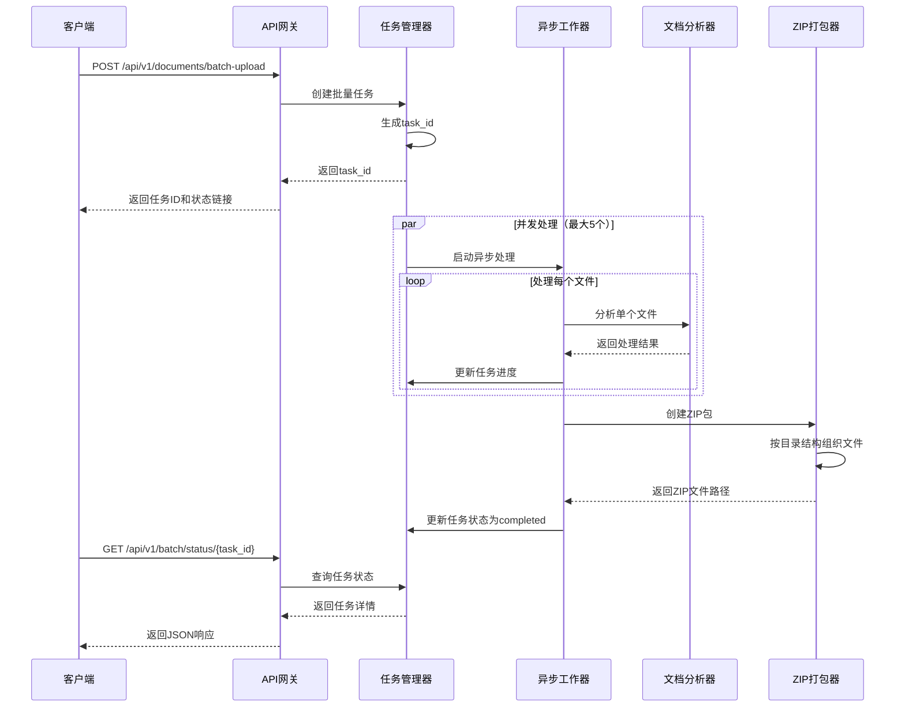
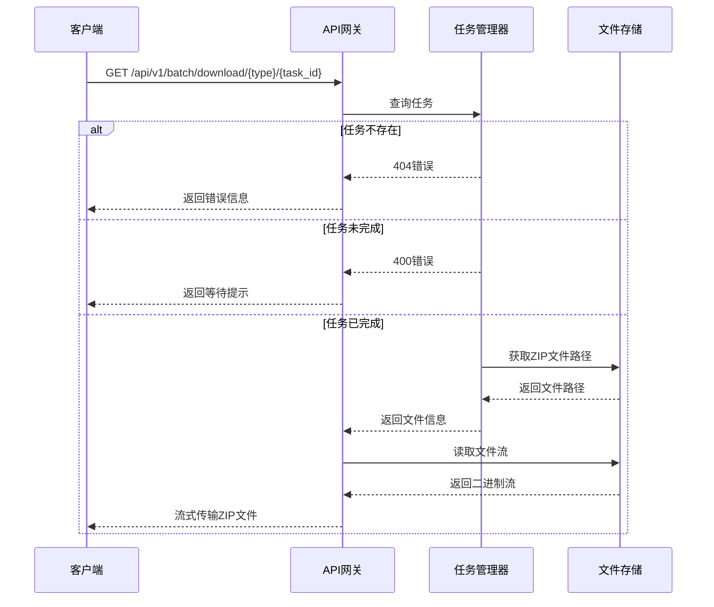

# 文档纯文本检测与批量处理系统 - 技术设计文档

## 1. 系统概述

### 1.1 设计目标

本系统旨在提供一个高效的文档分析与转换服务，核心功能包括：

- 智能识别文档是否为纯文本类型（不含图片、图表等富媒体元素）
- 将纯文本文档统一转换为 DOCX 格式
- 支持单文件和批量文件上传处理
- 完整保留上传文件的目录结构
- 提供分类下载能力（纯文本转换包、富媒体原文件包、完整文件包）

### 1.2 支持的文件格式

| 文件类型 | 支持格式 | 处理策略 |
|---------|---------|---------|
| 文本类 | .txt, .md | 检测图片引用语法，直接转换 |
| Office新格式 | .docx, .xlsx, .pptx | 原生解析，检测嵌入对象 |
| Office旧格式 | .doc, .xls, .ppt | 先转换为新格式，再处理 |
| PDF | .pdf | 解析页面元素，检测图片 |

### 1.3 技术栈选型

| 组件 | 技术选型 | 用途 |
|------|---------|------|
| Web框架 | FastAPI | 异步API服务 |
| 文档解析 | python-docx, openpyxl, python-pptx, PyMuPDF | 多格式文档处理 |
| 格式转换 | LibreOffice (headless) | 旧格式Office文档转换 |
| 并发控制 | asyncio.Semaphore | 限制并发处理数量 |
| 文件打包 | zipfile | 保留目录结构的文件打包 |
| 任务管理 | 内存字典 + 文件系统 | 批量任务状态追踪 |

## 2. 系统架构设计

### 2.1 整体架构



### 2.2 核心模块划分

#### 2.2.1 API网关层

**职责**：接收HTTP请求，参数验证，响应格式化

**端点设计**：

| 端点 | 方法 | 功能 | 输入 | 输出 |
|-----|------|------|------|------|
| /api/v1/document/analyze | POST | 单文件分析 | multipart文件 | 分析结果+下载链接 |
| /api/v1/documents/batch-upload | POST | 批量上传 | multipart文件列表 | 任务ID+状态链接 |
| /api/v1/batch/status/{task_id} | GET | 查询任务状态 | 任务ID | 任务进度+文件列表 |
| /api/v1/batch/download/pure-converted/{task_id} | GET | 下载纯文本转换包 | 任务ID | ZIP文件流 |
| /api/v1/batch/download/rich-original/{task_id} | GET | 下载富媒体原文件包 | 任务ID | ZIP文件流 |
| /api/v1/batch/download/all/{task_id} | GET | 下载完整文件包 | 任务ID | ZIP文件流 |

#### 2.2.2 文档分析器

**职责**：识别文件格式，调用对应的纯度检测器

**处理流程**：

1. 根据文件扩展名确定文件类型
2. 如果是旧格式Office文件，先调用格式转换器
3. 调用对应的纯度检测器
4. 返回检测结果和元数据

#### 2.2.3 纯度检测器

**职责**：检测文档中是否包含富媒体元素

**检测规则**：

| 文件类型 | 检测对象 | 判定为富媒体的条件 |
|---------|---------|------------------|
| TXT/MD | 文本内容 | 包含图片引用语法 `` |
| DOCX | inline_shapes, 嵌入对象 | 存在任何图片或嵌入对象 |
| XLSX | _images, _charts | 存在图表或图片 |
| PPTX | shapes类型 | 存在图片、形状、图表 |
| PDF | 页面图片对象 | 任何页面包含图片 |

**输出**：

```
{
    "is_pure_text": boolean,
    "media_count": integer,
    "reason": string  // 如果非纯文本，说明原因
}
```

#### 2.2.4 格式转换器

**职责**：将各类文档转换为统一的DOCX格式

**转换策略**：

| 源格式 | 转换方法 | 处理要点 |
|-------|---------|---------|
| TXT | python-docx | 按段落分割，保留换行 |
| MD | python-docx | 解析Markdown语法，转换为格式化段落 |
| XLSX | openpyxl → docx | 按工作表组织，每行转为段落 |
| PPTX | python-pptx → docx | 按幻灯片组织，提取文本内容 |
| PDF | PyMuPDF → docx | 提取文本块，保留段落结构 |
| DOC/XLS/PPT | LibreOffice CLI | 调用外部命令行工具转换 |

#### 2.2.5 任务管理器

**职责**：管理批量处理任务的生命周期

**任务状态**：

| 状态 | 说明 |
|------|------|
| pending | 任务已创建，等待处理 |
| processing | 正在处理中 |
| completed | 全部完成 |
| failed | 处理失败 |
| partial_success | 部分成功 |

**数据结构**：

```
Task {
    task_id: 唯一任务标识
    status: 任务状态
    total_files: 总文件数
    processed_files: 已处理文件数
    pure_text_count: 纯文本文档数量
    rich_media_count: 富媒体文档数量
    pure_text_files: 纯文本文件信息列表
    rich_media_files: 富媒体文件信息列表
    created_at: 创建时间
    updated_at: 更新时间
    error_message: 错误信息（如有）
}
```

#### 2.2.6 ZIP打包器

**职责**：按照目录结构打包文件

**打包策略**：

1. **纯文本转换包**：仅包含转换后的DOCX文件，保留原始目录结构
2. **富媒体原文件包**：仅包含富媒体文档的原始文件，保留原始目录结构
3. **完整文件包**：包含所有文件（纯文本转换后 + 富媒体原文件），保留原始目录结构

**目录结构保留机制**：

- 从上传文件的 `filename` 参数中提取完整路径
- 在ZIP包中按照原始路径创建目录树
- 支持多级嵌套目录

## 3. 数据流设计

### 3.1 单文件处理流程



### 3.2 批量处理流程



### 3.3 下载流程



## 4. 关键技术决策

### 4.1 路径解析与保留策略

**决策**：从上传文件的 `filename` 参数中提取完整路径信息

**实现要点**：

1. 客户端上传时需指定 `filename` 参数，格式如：`finance/report.pdf`
2. 服务端使用 `pathlib.Path` 解析路径
3. 提取目录部分和文件名部分
4. 在处理过程中始终保留路径信息
5. 打包时按照路径创建目录结构

**路径信息结构**：

```
{
    "full_path": "finance/report.pdf",
    "directory": "finance",
    "filename": "report.pdf",
    "stem": "report",
    "extension": ".pdf"
}
```

### 4.2 并发控制策略

**决策**：使用 `asyncio.Semaphore` 限制最大并发数为 5

**理由**：

1. 防止同时处理过多文件导致系统资源耗尽
2. LibreOffice转换进程占用较大内存
3. 平衡处理速度和系统稳定性

**实现方式**：

- 创建全局信号量：`semaphore = asyncio.Semaphore(5)`
- 每个文件处理前获取信号量
- 处理完成后释放信号量
- 支持通过配置调整并发数

### 4.3 旧格式转换策略

**决策**：使用 LibreOffice headless 模式进行转换

**理由**：

1. LibreOffice 是开源工具，兼容性好
2. 支持批量转换，无需图形界面
3. 转换质量高，保留格式完整

**命令格式**：

```
libreoffice --headless --convert-to <target_format> <input_file> --outdir <output_dir>
```

**异常处理**：

- 转换超时：设置30秒超时限制
- 转换失败：记录错误日志，标记为富媒体文档
- 进程泄漏：使用进程池管理，确保进程回收

### 4.4 任务状态存储策略

**决策**：使用内存字典 + 文件系统持久化

**存储方案**：

1. **内存存储**：活跃任务保存在内存字典中，快速访问
2. **文件持久化**：任务元数据保存为JSON文件，防止服务重启丢失
3. **文件存储**：处理后的文件保存在临时目录，定期清理

**清理策略**：

- 任务完成后保留24小时
- 每小时执行一次清理任务
- 删除超过24小时的任务文件

### 4.5 错误处理策略

**容错原则**：部分失败不影响整体任务

**错误分类**：

| 错误类型 | 处理策略 |
|---------|---------|
| 文件格式不支持 | 跳过该文件，记录错误信息 |
| 文件损坏 | 标记为失败，继续处理其他文件 |
| 转换失败 | 保留原文件，标记为富媒体 |
| 存储空间不足 | 中止任务，返回错误 |
| 并发限制超时 | 重试3次，仍失败则跳过 |

**错误响应结构**：

```
{
    "file_path": "finance/report.doc",
    "status": "failed",
    "error_code": "CONVERSION_FAILED",
    "error_message": "LibreOffice转换超时"
}
```

## 5. API设计规范

### 5.1 单文件上传接口

**端点**：`POST /api/v1/document/analyze`

**请求头**：
```
Content-Type: multipart/form-data
```

**请求体**：
| 字段 | 类型 | 必填 | 说明 |
|-----|------|------|------|
| file | File | 是 | 上传的文档文件 |

**响应结构**（纯文本文档）：
```
{
    "is_pure_text": true,
    "original_file": {
        "name": "report.pdf",
        "path": "finance/report.pdf",
        "size": 102400,
        "download_url": "/api/v1/files/download/original/abc123.pdf"
    },
    "converted_file": {
        "name": "report.docx",
        "path": "finance/report.docx",
        "size": 51200,
        "download_url": "/api/v1/files/download/converted/abc123.docx"
    }
}
```

**响应结构**（富媒体文档）：
```
{
    "is_pure_text": false,
    "reason": "包含3张图片",
    "original_file": {
        "name": "presentation.pptx",
        "path": "marketing/presentation.pptx",
        "size": 2048000,
        "download_url": "/api/v1/files/download/original/def456.pptx"
    }
}
```

### 5.2 批量上传接口

**端点**：`POST /api/v1/documents/batch-upload`

**请求头**：
```
Content-Type: multipart/form-data
```

**请求体**：
| 字段 | 类型 | 必填 | 说明 |
|-----|------|------|------|
| files | File[] | 是 | 文件列表，每个文件需指定filename参数 |

**响应结构**：
```
{
    "task_id": "batch_20251110_abc123",
    "total_files": 10,
    "status": "processing",
    "status_url": "/api/v1/batch/status/batch_20251110_abc123",
    "created_at": "2025-01-10T12:00:00Z"
}
```

### 5.3 任务状态查询接口

**端点**：`GET /api/v1/batch/status/{task_id}`

**路径参数**：
| 参数 | 类型 | 说明 |
|-----|------|------|
| task_id | string | 任务唯一标识 |

**响应结构**：
```
{
    "task_id": "batch_20251110_abc123",
    "status": "completed",
    "progress": {
        "total": 10,
        "completed": 10,
        "failed": 0,
        "pure_text_count": 7,
        "rich_media_count": 3
    },
    "pure_text_files": [
        {
            "original_path": "finance/report.pdf",
            "converted_path": "finance/report.docx"
        }
    ],
    "rich_media_files": [
        {
            "path": "marketing/presentation.pptx",
            "reason": "包含图片"
        }
    ],
    "downloads": {
        "pure_text_converted": "/api/v1/batch/download/pure-converted/batch_20251110_abc123",
        "rich_media_original": "/api/v1/batch/download/rich-original/batch_20251110_abc123",
        "all_files": "/api/v1/batch/download/all/batch_20251110_abc123"
    },
    "created_at": "2025-01-10T12:00:00Z",
    "updated_at": "2025-01-10T12:05:30Z"
}
```

### 5.4 批量下载接口

**端点**：
- `GET /api/v1/batch/download/pure-converted/{task_id}` - 纯文本转换包
- `GET /api/v1/batch/download/rich-original/{task_id}` - 富媒体原文件包
- `GET /api/v1/batch/download/all/{task_id}` - 完整文件包

**路径参数**：
| 参数 | 类型 | 说明 |
|-----|------|------|
| task_id | string | 任务唯一标识 |

**响应头**：
```
Content-Type: application/zip
Content-Disposition: attachment; filename="pure_text_converted_batch_20251110_abc123.zip"
```

**响应体**：ZIP文件二进制流

## 6. 异常处理设计

### 6.1 HTTP状态码规范

| 状态码 | 场景 | 响应消息示例 |
|-------|------|------------|
| 200 | 处理成功 | 返回正常数据 |
| 400 | 参数错误 | "不支持的文件格式" |
| 404 | 资源不存在 | "任务不存在" |
| 413 | 文件过大 | "文件大小超过限制（最大100MB）" |
| 422 | 验证失败 | "文件内容损坏" |
| 500 | 服务器错误 | "文档转换失败" |
| 503 | 服务不可用 | "LibreOffice服务不可用" |

### 6.2 错误响应格式

```
{
    "error": {
        "code": "FILE_TOO_LARGE",
        "message": "文件大小超过限制",
        "details": {
            "max_size": 104857600,
            "actual_size": 157286400
        }
    }
}
```

### 6.3 重试机制

**适用场景**：

- LibreOffice转换超时
- 文件系统临时不可用
- 网络IO异常

**重试策略**：

- 最大重试次数：3次
- 重试间隔：指数退避（1s, 2s, 4s）
- 超过重试次数后标记为失败

## 7. 性能优化设计

### 7.1 并发处理优化

**策略**：

1. 使用异步IO处理文件上传和下载
2. 并发限制为5个文件同时处理
3. 大文件分块读取，避免内存溢出

### 7.2 文件存储优化

**策略**：

1. 使用临时目录存储中间文件
2. 处理完成后立即清理临时文件
3. ZIP文件流式生成，边压缩边传输

### 7.3 内存管理优化

**策略**：

1. 大文件使用流式处理，不一次性加载到内存
2. 及时释放已处理文件的内存引用
3. 设置单个文件大小限制（建议100MB）

## 8. 部署架构设计

### 8.1 服务部署方案

**推荐部署方式**：Docker容器化部署

**容器配置**：

| 配置项 | 值 | 说明 |
|-------|---|------|
| CPU | 2核 | 支持并发处理 |
| 内存 | 4GB | LibreOffice需要较大内存 |
| 磁盘 | 20GB | 存储临时文件和任务数据 |
| 端口 | 8000 | FastAPI默认端口 |

**依赖服务**：

- LibreOffice（容器内安装）
- Python 3.10
- 临时文件存储目录（挂载卷）

### 8.2 环境变量配置

| 变量名 | 默认值 | 说明 |
|-------|-------|------|
| MAX_FILE_SIZE | 104857600 | 单文件最大大小（100MB） |
| MAX_CONCURRENT_TASKS | 5 | 最大并发处理数 |
| TASK_RETENTION_HOURS | 24 | 任务保留时长（小时） |
| TEMP_DIR | /tmp/doc_processor | 临时文件目录 |
| LIBREOFFICE_PATH | /usr/bin/libreoffice | LibreOffice可执行文件路径 |

### 8.3 目录结构规划

```
/app
├── main.py                 # FastAPI应用入口
├── routers/               # 路由模块
│   ├── document.py        # 单文件处理路由
│   └── batch.py          # 批量处理路由
├── services/             # 业务逻辑层
│   ├── analyzer.py       # 文档分析器
│   ├── detector.py       # 纯度检测器
│   ├── converter.py      # 格式转换器
│   ├── task_manager.py   # 任务管理器
│   └── packager.py       # ZIP打包器
├── models/               # 数据模型
│   ├── request.py        # 请求模型
│   └── response.py       # 响应模型
├── utils/                # 工具函数
│   ├── path_parser.py    # 路径解析
│   └── file_utils.py     # 文件操作
└── requirements.txt      # 依赖清单
```

## 9. 监控与日志设计

### 9.1 日志记录规范

**日志级别**：

| 级别 | 使用场景 |
|------|---------|
| DEBUG | 详细的处理流程，仅开发环境 |
| INFO | 任务开始、完成、状态变更 |
| WARNING | 文件处理失败但不影响整体 |
| ERROR | 转换失败、存储错误 |
| CRITICAL | 服务不可用、系统错误 |

**日志内容**：

```
{
    "timestamp": "2025-01-10T12:00:00Z",
    "level": "INFO",
    "module": "converter",
    "task_id": "batch_20251110_abc123",
    "file_path": "finance/report.pdf",
    "action": "convert_to_docx",
    "duration_ms": 1500,
    "status": "success"
}
```

### 9.2 性能指标监控

**关键指标**：

| 指标 | 说明 | 告警阈值 |
|------|------|---------|
| 文件处理时长 | 单个文件平均处理时间 | > 30秒 |
| 任务完成率 | 成功完成的任务比例 | < 95% |
| 并发处理数 | 当前正在处理的文件数 | = 最大并发数（可能阻塞） |
| 磁盘使用率 | 临时目录磁盘占用 | > 80% |
| 内存使用率 | 服务进程内存占用 | > 3GB |

## 10. 安全设计

### 10.1 文件上传安全

**防护措施**：

1. **文件类型验证**：仅允许白名单中的文件扩展名
2. **文件大小限制**：单文件最大100MB
3. **文件内容验证**：检查MIME类型与扩展名是否匹配
4. **路径注入防护**：清理filename中的 `..` 和绝对路径

### 10.2 文件存储安全

**防护措施**：

1. **随机文件名**：使用UUID避免文件名冲突和猜测
2. **目录隔离**：每个任务使用独立的子目录
3. **定期清理**：自动删除过期任务文件
4. **访问控制**：临时文件目录仅服务进程可访问

### 10.3 ZIP炸弹防护

**防护措施**：

1. **压缩前大小检查**：限制单个ZIP包最大10GB
2. **文件数量限制**：单个ZIP包最多1000个文件
3. **压缩比检查**：压缩比异常时拒绝生成

## 11. 扩展性设计

### 11.1 新格式支持扩展

**扩展点**：在 `detector.py` 和 `converter.py` 中添加新的格式处理器

**步骤**：

1. 实现新的检测函数：`detect_<format>_purity(file_path) -> bool`
2. 实现新的转换函数：`convert_<format>_to_docx(file_path) -> docx_path`
3. 在主流程中注册新格式的处理器
4. 更新API文档说明支持的格式

### 11.2 存储后端扩展

**当前方案**：文件系统存储

**扩展方案**：

- 对接Redis存储元数据（根据项目规范，禁用S3）
- 使用Redis Hash存储任务信息
- 使用Redis Set存储任务文件列表
- 文件内容仍存储在文件系统

**Redis数据结构设计**：

```
# 任务元数据
HSET task:{task_id} status "completed"
HSET task:{task_id} total_files 10
HSET task:{task_id} pure_text_count 7

# 任务文件列表
SADD task:{task_id}:pure_files "finance/report.docx"
SADD task:{task_id}:rich_files "marketing/presentation.pptx"

# 任务过期时间
EXPIRE task:{task_id} 86400
```


|


